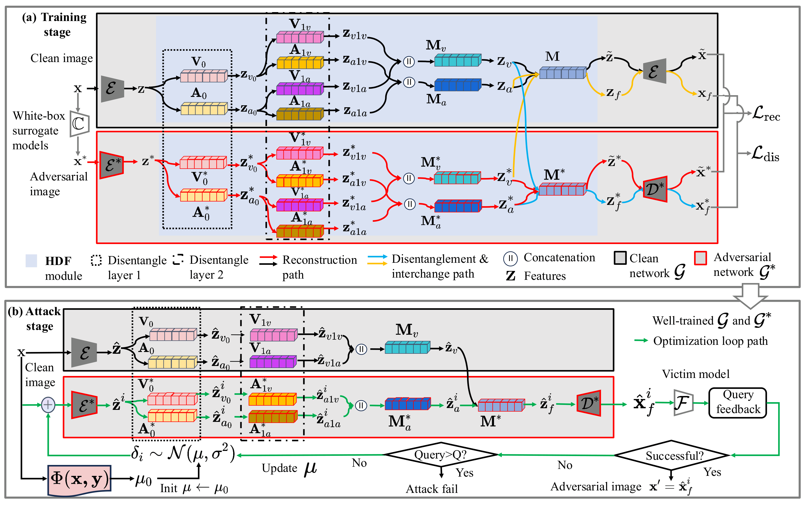

# DifAttack++
## The official code for the TDSC 2026 paper 'DifAttack++: Query-Efficient Black-Box Adversarial Attack via Hierarchical Disentangled Feature Space in Cross–Domain'.

<p align="center">
  
</p>

<p align="center">
  <em>Overview of the DifAttack++ framework.</em>
</p>

## Train autoencoders for image reconstruction and feature disentanglement:
set mode="train" in main.py
```
Python main.py
```

## Perform score-based black-box attack
set mode="test" in main.py
```
Python main.py
```

set attackType=None to perform attacks in open-set scenarios
set attackType=FTM for closed-scenario targeted, attackType=PGN for closed-scenario untargeted

## Model Weights and Datasets

Please download the model weights and datasets from https://zenodo.org/records/23003864

## Acknowledgements
Part of the code is partially derived from ImageReconstruction [Github](https://github.com/SikanderBinMukaram/ImageReconstructionAutoEncoder/blob/main/ImageReconstruction.ipynb) and torchattacks [Github](https://github.com/Harry24k/adversarial-attacks-pytorch/tree/master).


# DifAttack++

Official implementation of our **IEEE TDSC 2026** paper:

> **DifAttack++: Query-Efficient Black-Box Adversarial Attack via Hierarchical Disentangled Feature Space in Cross-Domain**

## Training Autoencoders

To train the autoencoders for image reconstruction and feature disentanglement, set:

```python
mode = "train"
```

in `main.py`, and then run:

```bash
python main.py
```

## Performing Score-Based Black-Box Attacks

To perform score-based black-box attacks, set:

```python
mode = "test"
```

in `main.py`, and then run:

```bash
python main.py
```

### Attack Settings

Configure `attackType` in `main.py` according to the desired attack setting:

- **Open-set attack:** `attackType = None`
- **Closed-set targeted attack:** `attackType = "FTM"`
- **Closed-set untargeted attack:** `attackType = "PGN"`

## Model Weights and Test Data

The pretrained disentangled autoencoders and test data can be downloaded from Zenodo:

https://zenodo.org/records/23003864

The autoencoder files follow the naming convention:

```text
[victim_model]_[targeted/untargeted]
```

The `[victim_model]` prefix indicates the victim model that was excluded from the surrogate-model set during autoencoder training within the corresponding **Simple** or **Complex** model group. Therefore, when this model is used as the victim model, the corresponding autoencoder can be used for feature disentanglement during the black-box attack.

The suffix indicates whether the autoencoder corresponds to the **targeted** or **untargeted** attack setting.

The `ImageNetVal_random_Cropped224` folder contains the test images used for evaluation.

## Contact

If you have any questions regarding reproduction or the paper, please feel free to open an issue in this repository or contact me via email at [csjunliu@nii.ac.jp](mailto:csjunliu@nii.ac.jp).

## Citation

If you find this work useful for your research, please consider citing our paper:

```bibtex
@ARTICLE{DifAttackPlus2026TDSC,
  author={Liu, Jun and Zhou, Jiantao and Zeng, Jiandian and Tian, Jinyu and Echizen, Isao},
  journal={IEEE Transactions on Dependable and Secure Computing},
  title={DifAttack++: Query-Efficient Black-Box Adversarial Attack via Hierarchical Disentangled Feature Space in Cross-Domain},
  year={2026},
  pages={1-18},
  doi={10.1109/TDSC.2026.3726589}
}
```

## Acknowledgements

Part of this implementation is derived from or adapted based on the following open-source projects:

- [ImageReconstruction](https://github.com/SikanderBinMukaram/ImageReconstructionAutoEncoder/blob/main/ImageReconstruction.ipynb)
- [torchattacks](https://github.com/Harry24k/adversarial-attacks-pytorch/tree/master)

We thank the authors for making their code publicly available.
